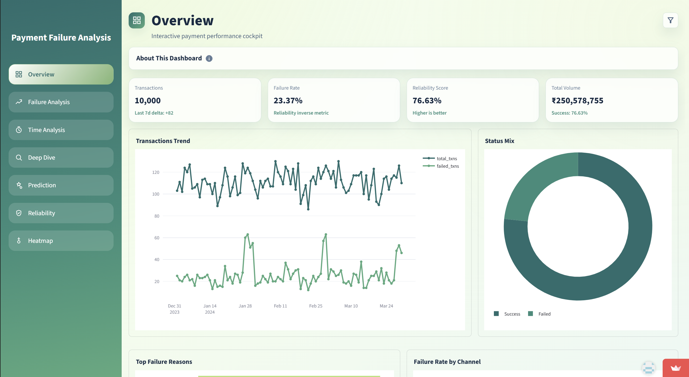
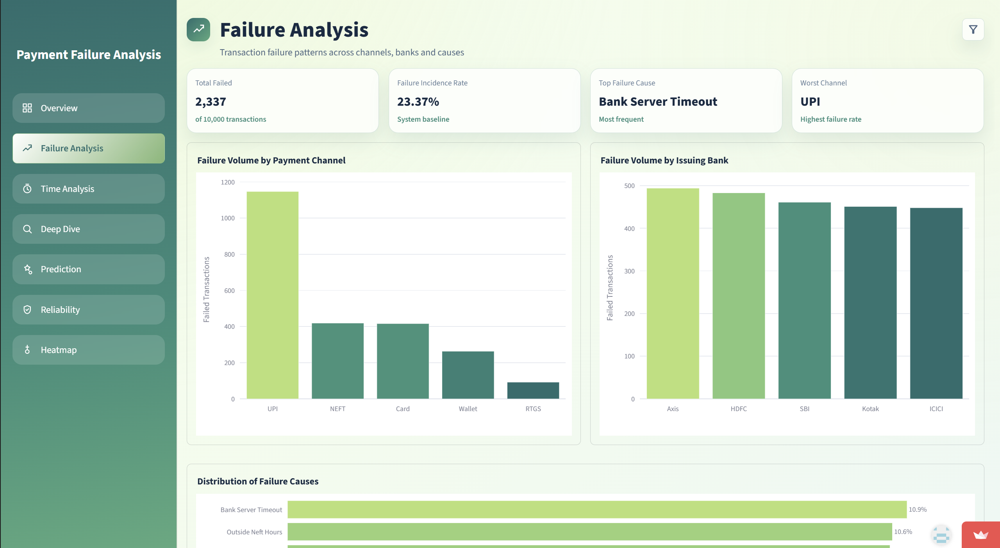
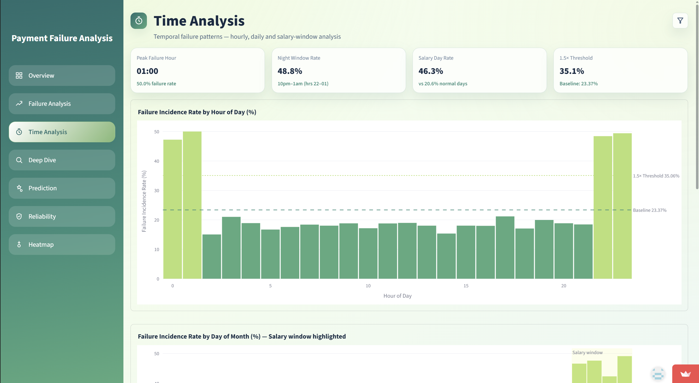
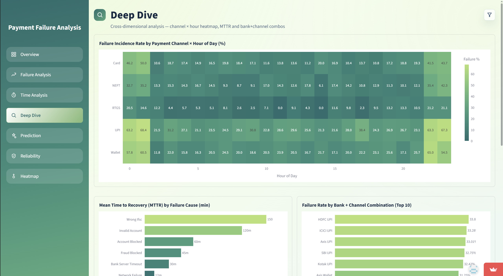
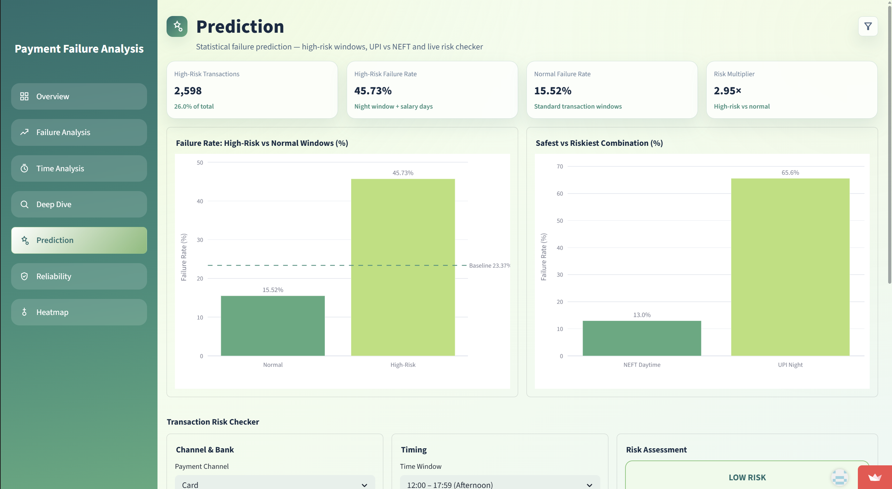
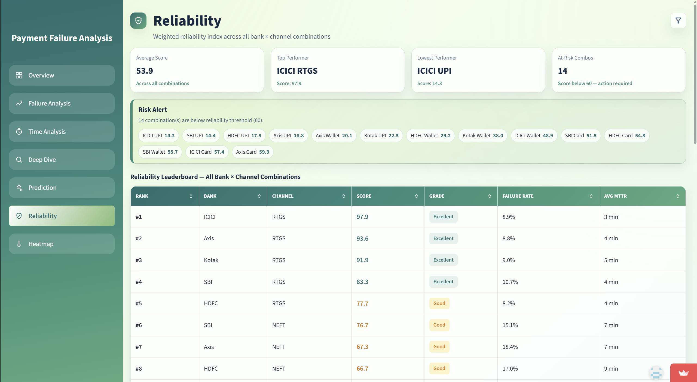
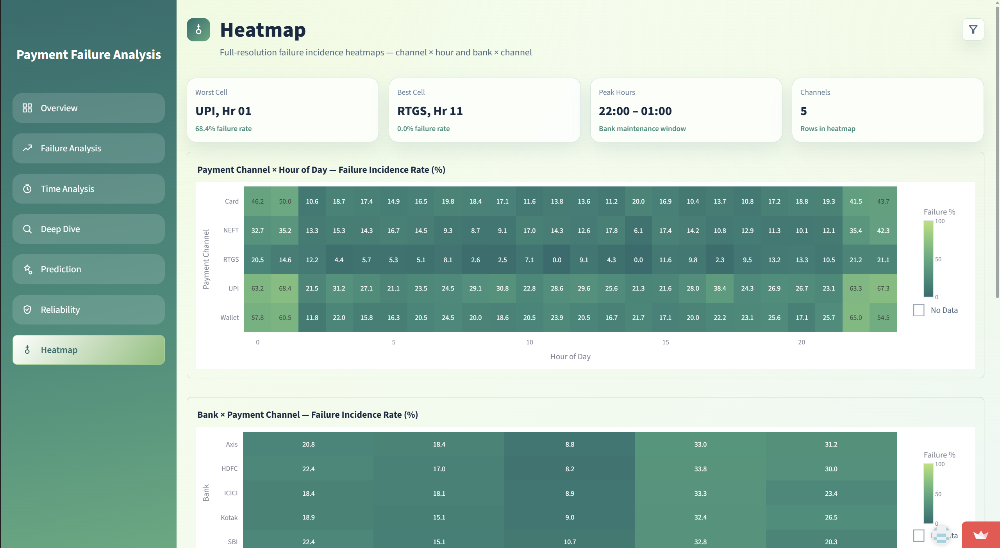

# PaymentGuard – Payment Failure Analysis Dashboard

PaymentGuard is an interactive **Streamlit dashboard** designed to analyze payment transaction failures across channels, banks, and time periods.



It helps answer key questions like:

- Where failures occur most frequently
- Which banks/channels are least reliable
- When risk spikes during the day/month
- What needs operational intervention

---

## Features

### Interactive Dashboard

- Multi-page navigation (Overview, Failure Analysis, Time Analysis, Deep Dive, Prediction, Reliability, Heatmap)
- KPI cards, charts, and tables
- Fully interactive visuals (Plotly)

### Global Filters

- Filter by Channel, Bank, Date Range, Failure Reason
- Filters persist across pages
- “Clear Filters” option resets all selections

### Analytics & Insights

- Failure trends over time
- Channel & bank performance comparison
- Heatmaps and failure patterns
- Top failure reasons

### Reliability Scoring

- Score (0–100) for each Bank + Channel
- Based on:
  - Failure rate (50%)
  - MTTR (30%)
  - Severity (20%)

- Categories: **Excellent, Good, At Risk**

### Prediction & Risk Analysis

- High-risk vs normal comparisons
- Risk checker (channel, bank, time, day)
- Operational recommendations

---

## Screenshots

### Overview


### Failure Analysis



### Time Analysis



### Deep Dive



### Prediction



### Reliability



### Heatmap



---

## 🗂️ Project Structure

```
payment-failure-analysis/
│── assets/
│   └── screenshots/                 # README dashboard screenshots
│── PaymentFailureAnalysis/
│   ├── app/                         # Streamlit app
│   ├── data/                        # Dataset files
│   ├── notebooks/                   # EDA & analysis notebooks
│   ├── scripts/                     # Data generation scripts
│   └── charts/                      # Exported charts
│── README.md
└── requirements.txt
```

---

## Tech Stack

- **Frontend & App**: Streamlit
- **Visualization**: Plotly
- **Backend/Data**: Python (Pandas, NumPy)

---

## Getting Started

### 1️) Install Dependencies

```bash
pip install -r requirements.txt
```

### 2️) Run the App

```bash
streamlit run app/streamlit_app.py
```

### 3️) Open in Browser

```
http://localhost:8501
```

---

## Dataset

Main file:

```
data/transactions_raw.csv
```

Includes:

- Transaction details
- Bank & channel info
- Failure reasons
- Time-based features

---

## Generate Sample Data

```bash
python scripts/generate_data.py
```

- Creates ~10,000 synthetic transactions
- Simulates real-world risk patterns

---

## Key Pages

- **Overview** → KPIs & trends
- **Failure Analysis** → Failure breakdown
- **Time Analysis** → Time-based insights
- **Deep Dive** → Advanced analysis
- **Prediction** → Risk insights
- **Reliability** → Scoring & ranking
- **Heatmap** → Pattern visualization

---

## Performance

- Uses caching (`st.cache_data`)
- Optimized aggregations
- Handles empty/filtered states safely

---

## Troubleshooting

**App not running?**

- Check Python version (3.10+)
- Install dependencies

**No data?**

- Ensure dataset exists
- Run data generation script

**Port issue?**

```bash
streamlit run app/streamlit_app.py --server.port 8502
```

---

## Future Improvements

- Export reports (CSV/PDF)
- Role-based access
- Automated alerts
- Modular code structure

---

If you like this project, consider giving it a star!
